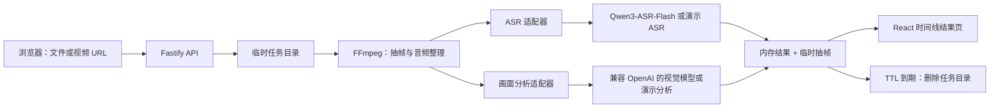

# 盯帧视频分析设计

## 目标

为小视频提供本地上传和直接 URL 两种入口，完成抽帧、ASR 听写和时间线式结果展示；视频与中间文件不进入长期存储。

## 视觉方向

沿用参考项目的米白纸张、苔绿色主色、铁锈色提示、衬线大标题和安静侧栏。主界面把“视频播放器”换成“关键画面舞台”，右侧保留理解侧栏，强调从线索进入内容，而不是堆叠控制台指标。

## 架构

第一版使用单 Node.js 进程、内存任务表和一个 Docker 容器。上传/下载会流入服务端临时目录；结果页只通过带随机任务 ID 的接口读取抽帧。真实 ASR 将一分钟以内的 MP3 切片编码为 Base64，直接调用 Qwen3-ASR-Flash，不引入 Bucket。

## 关键决策

1. **Node.js + Fastify**：前后端可以同容器运行，Fastify 对流式请求和小型 API 足够轻。
2. **React + Vite**：承载有状态的上传、进度轮询和时间线，仍保持单页原型的轻量感。
3. **FFmpeg**：抽帧和音频标准化都由同一个工具负责，避免在 Node 中维护媒体编解码逻辑。
4. **适配器而不是锁死模型**：无密钥时 mock，配置百炼后使用 Qwen3-ASR-Flash；画面理解使用兼容 OpenAI Chat Completions 的接口，便于切换模型。
5. **不引入数据库/队列**：小视频 MVP 先接受单实例和重启丢任务，避免过早建平台基础设施。

## 错误与边界

- 默认限制 500MB、15 分钟、最多 12 张抽帧。
- URL 入口只接受 HTTP/HTTPS，拒绝本机地址；第一版要求 URL 可直接下载视频。
- 模型没有配置时不阻塞 UI 验证，使用演示 ASR/分析结果。
- 任一步失败都把任务标记为 failed，并清理原视频与音频。
- 任务 TTL 到期时删除整个临时目录，手动“立即清除”也走同一条路径。
